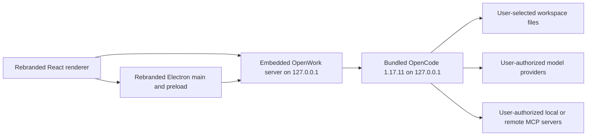

# AgencyAI Desktop MVP Implementation Plan

Status: final implementation blueprint; ready to execute
Research date: 2026-07-27
Second-pass review: 2026-07-27 — six independent audit assignments completed in two waves
Implementation repository: [`artreimus/AgencyAI`](https://github.com/artreimus/AgencyAI), branch `dev`
Upstream snapshot: `different-ai/openwork` branch `dev`, commit `1f41a52070cbc400b17b05136533e8d3737e25da`
PR 00 implementation baseline: `1f41a52070cbc400b17b05136533e8d3737e25da`
Target release: `AgencyAI Desktop 0.1.0-beta.1`, a signed and notarized Apple-silicon macOS desktop agent that runs a bundled, minimally patched OpenCode engine locally and does not connect to OpenWork Cloud

## Executive decision

AgencyAI will keep the OpenWork desktop wrapper and its embedded local server. It will not replace that product layer with a new UI directly on the OpenCode SDK for this MVP.

The existing packaged architecture already provides the difficult desktop product layer: workspace routing, session state, local filesystem controls, approvals, artifacts, skills, MCP management, provider authentication, computer use, browser integration, packaging, and a managed OpenCode process. OpenWork Cloud is cross-cutting but separable. The safest change is one immutable `local-mvp` product profile that selects a local-only composition at the renderer, server, Electron, build, documentation, and release boundaries while leaving cloud source code in place.

Do not combine this work with an OpenCode feature-line upgrade. Keep the OpenCode wire/API contract and every `@opencode-ai/sdk` consumer pinned to exact version `1.17.11`, but build the binary from `artreimus/AgencyAI-OpenCode`, forked from the exact `v1.17.11` commit with the minimal runtime-download-denial patch described below. Treat newer OpenCode releases as a later compatibility project.

Before any public distribution, upgrade Electron from the repository's obsolete `35.7.5` line to the latest supported stable release available at implementation time, then repeat the native-module, packaging, security, and installer validation matrix. OpenCode remains pinned independently.

This plan uses “local-only” to mean:

- OpenWork Cloud, Den auth, organization policy, org sync, cloud memory, hosted OpenWork Models, telemetry, upstream updater, cloud bootstrap, and upstream runtime-download fallbacks never run.
- OpenWork and OpenCode bind to loopback and remain authenticated.
- The user may still authorize network traffic to their chosen model provider, MCP server, web page, or optional integration.
- The application can start, open a workspace, and reach a usable local session with all non-user-initiated vendor egress blocked.

An air-gapped mode is a related but stricter profile. The MVP packages its OpenCode binary, uses the model catalog embedded in that binary, packages required helper executables, and denies silent runtime downloads. Provider, user-configured remote MCP, browser, and explicitly enabled integration traffic remain user-authorized egress.

## Final MVP cutline

| Decision | AgencyAI MVP |
|---|---|
| Product | `AgencyAI Desktop 0.1.0-beta.1` |
| Source | Public fork at `artreimus/AgencyAI`; PR 00 removes `/ee` from the product branch and every build while preserving upstream history and license provenance |
| Target platform | Apple-silicon macOS only for the MVP; minimum macOS 14 |
| Distribution | Signed and notarized DMG plus ZIP; manual download and manual upgrades |
| Runtime | Electron wrapper + embedded AgencyAI server + minimally patched OpenCode `1.17.11` |
| Workspaces | User-selected local folders only |
| Models | User-supplied provider credentials, Ollama, or another local/OpenAI-compatible endpoint |
| MCP | Local MCP and explicitly user-configured remote MCP, including ordinary MCP OAuth |
| Desktop capabilities | Filesystem tools, approvals, artifacts, skills, browser automation, and macOS computer use |
| Network promise | Zero non-loopback traffic before user configuration or an explicit user action |
| Product account | None |
| Billing/licensing | External checkout and controlled access to signed builds/support; no in-app license enforcement |
| Updates | Disabled; no upstream or AgencyAI auto-update feed in the MVP |
| Public URL protocol | None; only a private internal Electron renderer scheme |
| Analytics | None |
| Cloud features | None; no Den, cloud workers, remote workspaces, org policy, OpenWork Models, cloud memory, sharing, or hosted search |

This is a commercial desktop beta, not a SaaS control plane. With application authentication and billing explicitly excluded, the MVP can be sold as access to signed builds, updates delivered manually, support, and services. Enforced recurring desktop licensing or hosted agent execution is a separate product phase.

### MVP user journey

1. The user downloads and opens the notarized AgencyAI DMG.
2. AgencyAI creates only its own isolated application state and opens the local workspace picker.
3. The user selects a local folder.
4. The user configures Ollama or supplies credentials for a supported model provider.
5. The user starts a session, reviews permission prompts, and lets the agent inspect or edit workspace files.
6. The user may add an MCP server, open the browser panel, or grant macOS computer-use permissions.
7. AgencyAI persists the local session and restores it after restart without contacting AgencyAI, OpenWork, or OpenCode control-plane services.

### Explicit post-MVP work

- Intel macOS, Windows, and Linux installers.
- Automatic updates and a signed AgencyAI update feed.
- In-app accounts, subscription enforcement, billing, team management, or a hosted control plane.
- Remote/cloud workers, remote workspaces, sharing, pairing, and organization policy.
- Google Workspace, bundled voice, hosted web search, remote asset/icon fetching, and public deep links.
- Air-gapped provider/model packaging.

## Second-pass release decisions

The six-audit pass changed or tightened these decisions:

| Area | Release decision | Why this is now explicit |
|---|---|---|
| OpenCode distribution | Maintain a minimal fork of exact upstream `v1.17.11`; add one runtime-download kill switch in `packages/core/src/flag/flag.ts` and `packages/core/src/npm.ts`, and package `rg` separately | Stock flags stop model refresh, updates, sharing, and LSP downloads, but do not stop every plugin, provider-SDK, formatter, or ripgrep fallback install |
| Renderer composition | Select `LocalAppProviders`, `LocalSettingsComposition`, and local session hooks before cloud hooks execute | Hidden components and neutral context values are insufficient when mounted hooks restore credentials, attach Den listeners, retry, or mutate OpenCode config |
| Persisted state | Quarantine stored non-loopback server URLs, remote workspaces, cloud notifications, remote icons, bootstrap/handoff state, and remote-access flags | A rebranded build can inherit old OpenWork localStorage/config and make background calls without the user opening cloud UI |
| Process/storage isolation | Use an explicit `StorageLayout`, create every directory before Electron startup, set production XDG/OpenCode paths, and disable the global legacy config sweep | The current embedded server can otherwise inspect or rewrite shared `~/.config/opencode` state |
| Local trust boundary | Use a secure internal renderer scheme, exact CORS origin, strict CSP, sandboxing, validated IPC senders, and allowlisted external URLs | Loopback alone does not make privileged Electron IPC, OpenWork routes, or OpenCode routes trustworthy |
| Approvals | Keep OpenCode permission prompts; replace wrapper-wide `approvalMode: "auto"` with a short-lived Electron-issued `desktop` actor token and `trusted-local-ui` policy | Wrapper filesystem approvals and OpenCode tool permissions are separate systems; public builds must not auto-approve arbitrary loopback clients |
| Packaging | Build real installers, rebuild native modules for the Electron ABI, verify the exact sidecar/resource allowlist, pin Windows installer identity, and test upgrades | A successful renderer build or unpacked directory does not prove a distributable desktop product |
| Electron | Upgrade to the latest supported stable Electron before public release; retain the existing line only for short-lived implementation scaffolding | Electron `35` is outside its supported lifecycle and the current window/security defaults need hardening |
| Verification | Use pure policy tests plus the repository's CDP flow runner, packaged-app smoke tests, artifact inspection, and OS-level connection tracing | The repository does not currently have a React DOM/Playwright component-test stack, and browser instrumentation alone misses child-process egress |
| Licensing | Generate SBOMs and notices from the final installer closure, including Electron/Chromium, the patched OpenCode binary and its own dependency closure, native modules, helper, `rg`, model data, docs, and assets | The JavaScript workspace lockfile alone does not describe the shipped application |

Second-pass audit coverage:

1. Renderer/cloud lifecycle: mounted hooks, startup bridges, persisted state, settings composition, control actions, remote assets, and prompt injectors.
2. Electron/platform: identity, storage, legacy state, protocol/update removal, renderer trust, IPC/URL policy, native modules, helpers, and installer behavior.
3. Server/OpenCode local runtime: exact flags and routes, hidden download paths, environment/config policy, CORS/auth, proxy surface, model/provider defaults, and approvals.
4. Testing/release engineering: existing test infrastructure, packaged CDP flows, network observation, native smoke tests, installer tiers, and realistic estimates.
5. Commercial distribution: root versus `/ee` licensing, exact artifact closure, SBOMs/notices, native/sidecar/model data, and trademark-bearing assets.
6. Maintainability/upstream strategy: wrapper-versus-rewrite decision, smallest OpenCode patch queue, provenance manifest, fork workflow, and future upgrade mechanics.

The OpenCode source claims in this pass were checked against a clean checkout of exact tag `v1.17.11` at commit `67aec2212010d67775c35e696d8b8b54902eb338`, not inferred from current `main`.

## Scope

### Included

- New product name, logos, bundle IDs, executable names, helper IDs, support links, installer names, and release artifact names.
- New isolated application storage paths that do not read or mutate OpenWork state.
- Local Electron renderer, embedded OpenWork server, and bundled OpenCode server.
- A minimally patched OpenCode `1.17.11` binary, verified distribution manifest, and packaged `rg` executable.
- Local workspaces, sessions, filesystem tools, approvals, artifacts, skills, ordinary MCP servers, MCP OAuth, model-provider API keys/OAuth, and local model providers.
- Browser automation and macOS computer use, governed by explicit user permissions.
- A build-enforced `local-mvp` feature profile.
- A macOS arm64 desktop CI and release lane, with portable policy/build code that does not preclude later platforms.
- License notices, sidecar checksums, artifact inspection, and a no-OpenWork-egress test.
- A secure internal Electron renderer scheme, strict local trust policy, and real signed-installer validation.

### Disabled but retained in source

- OpenWork Cloud/Den account sign-in and onboarding.
- Organization membership, policies, dynamic organization branding, provider sync, prompts, marketplaces, templates, imports, shared connections, and cloud memory.
- OpenWork Cloud MCP and its reconciliation/diagnostics.
- OpenWork Models and any OpenWork-owned model catalog or voice session.
- Cloud/bootstrap installer import, claim links, handoff links, and OpenWork protocol handlers.
- Remote workspaces, pairing, remote access, router sharing, and team workspace sharing.
- Product analytics and Den telemetry.
- Automatic updates and alpha channels until a fork-owned signed feed exists.
- Runtime fallback downloads for the server, orchestrator, OpenCode, plugins, or language servers.
- Legacy OpenWork/Tauri migration and destructive “Fresh Start.”
- OpenWork-owned Google OAuth credentials and Google Workspace integration until replaced with the new company's OAuth client.
- Bundled voice, hosted web search, remote icon/favicon fetching, and other nonessential network integrations.

### Not included

- Deleting the disabled cloud implementation.
- Renaming internal `@openwork/*` packages, IPC channels, database fields, environment variables, or every `openwork` storage key.
- Replacing the React application or embedded OpenWork server with the upstream OpenCode desktop.
- Upgrading the OpenCode protocol/SDK beyond `1.17.11`.
- Building a new SaaS control plane, account system, billing system, or cloud worker platform.
- Subscription/license enforcement inside the application.
- Intel macOS, Windows, or Linux release artifacts for `0.1.0-beta.1`.
- Migrating users from OpenWork's application data.
- Publishing the `/ee` source under the new commercial product.

## Verified architecture

The desktop path does not require `/ee` or a hosted OpenWork control plane.



Relevant entrypoints:

- Electron runtime: `apps/desktop/electron/runtime.mjs`
- Embedded server startup: `apps/server/src/embedded.ts`
- Managed OpenCode process: `apps/server/src/managed-opencode.ts`
- Local API and OpenCode proxy: `apps/server/src/server.ts`
- Renderer SDK boundary: `apps/app/src/react-app/kernel/global-sdk-provider.tsx`

Security that must remain:

- Loopback binding for OpenWork and OpenCode.
- Generated OpenCode Basic Auth.
- OpenWork client, owner, and host bearer tokens and role scopes.
- Workspace-root authorization and filesystem approvals.
- OpenCode tool permissions and approval prompts.
- Provider API-key/OAuth and ordinary MCP OAuth flows.
- Credential redaction and safe external-fetch boundaries.

These mechanisms protect local privileged processes. They are not OpenWork Cloud authentication.

## Product capability contract

### One shared source of truth

Add `packages/product-config` and make it the only source for product identity and immutable capabilities.

Proposed files:

```text
packages/product-config/
  package.json
  src/index.ts
  src/schema.ts
  profiles/local-mvp.json
  profiles/upstream.json
  test/profile.test.ts
```

Use a concrete contract:

```ts
export type ProductProfileName = "local-mvp" | "upstream";

export type ProductFeature =
  | "openworkCloud"
  | "cloudBootstrap"
  | "connectLinks"
  | "dynamicOrgBranding"
  | "analytics"
  | "automaticUpdates"
  | "runtimeDownloads"
  | "runtimePluginInstall"
  | "remoteAssetFetches"
  | "hostedWebSearch"
  | "remoteWorkspaces"
  | "remoteAccess"
  | "workspaceSharing"
  | "legacyOpenWorkImport"
  | "freshStart"
  | "openworkModels"
  | "voice"
  | "googleWorkspace"
  | "browserAutomation"
  | "computerUse";

export type ProductBrand = Readonly<{
  name: string;
  slug: string;
  companyName: string;
  appId: string;
  devAppId: string;
  executableName: string;
  artifactPrefix: string;
  rendererScheme: string;
  protocol: string | null;
  nsisGuid: string;
  linuxDesktopName: string;
  supportEmail: string | null;
  docsUrl: string | null;
  feedbackUrl: string | null;
  issueUrl: string | null;
  repository: Readonly<{ owner: string; name: string }> | null;
  computerUse: Readonly<{
    displayName: string;
    bundleName: string;
    bundleId: string;
  }>;
}>;

export type ProductProfile = Readonly<{
  schemaVersion: 1;
  profile: ProductProfileName;
  brand: ProductBrand;
  features: Readonly<Record<ProductFeature, boolean>>;
  networkPolicy: "user-authorized" | "air-gapped";
}>;

export function getBuildProductProfile(): ProductProfile;
export function isProductFeatureEnabled(feature: ProductFeature): boolean;
```

The `local-mvp` defaults are:

```json
{
  "schemaVersion": 1,
  "profile": "local-mvp",
  "brand": {
    "name": "AgencyAI",
    "slug": "agencyai",
    "companyName": "AgencyAI",
    "appId": "com.artreimus.agencyai",
    "devAppId": "com.artreimus.agencyai.dev",
    "executableName": "agencyai",
    "artifactPrefix": "agencyai",
    "rendererScheme": "agencyai-internal",
    "protocol": null,
    "nsisGuid": "866CE9A3-13BF-49B0-9D56-C9C43706CB0E",
    "linuxDesktopName": "agencyai.desktop",
    "supportEmail": null,
    "docsUrl": null,
    "feedbackUrl": null,
    "issueUrl": "https://github.com/artreimus/AgencyAI/issues",
    "repository": {
      "owner": "artreimus",
      "name": "AgencyAI"
    },
    "computerUse": {
      "displayName": "AgencyAI Computer Use",
      "bundleName": "AgencyAI Computer Use.app",
      "bundleId": "com.artreimus.agencyai.computer-use"
    }
  },
  "features": {
    "openworkCloud": false,
    "cloudBootstrap": false,
    "connectLinks": false,
    "dynamicOrgBranding": false,
    "analytics": false,
    "automaticUpdates": false,
    "runtimeDownloads": false,
    "runtimePluginInstall": false,
    "remoteAssetFetches": false,
    "hostedWebSearch": false,
    "remoteWorkspaces": false,
    "remoteAccess": false,
    "workspaceSharing": false,
    "legacyOpenWorkImport": false,
    "freshStart": false,
    "openworkModels": false,
    "voice": false,
    "googleWorkspace": false,
    "browserAutomation": true,
    "computerUse": true
  },
  "networkPolicy": "user-authorized"
}
```

Validation must fail the build when:

- A cloud subfeature is enabled while `openworkCloud` is false.
- Updates are enabled without a fork-owned repository/feed.
- Connect links are enabled without a new protocol.
- A public OS protocol is enabled without a product-owned scheme and tested handler; `rendererScheme` is internal and must always be present.
- Product identity contains `com.differentai`, `openworklabs.com`, `different-ai/openwork`, or an OpenWork product/support URL.
- `local-mvp` enables remote asset fetching, hosted web search, runtime plugin installation, voice, legacy OpenWork import, or wildcard CORS.
- Windows `nsisGuid`, application IDs, helper IDs, and the internal renderer scheme are missing or unstable.
- A production `local-mvp` build contains a feature override that would broaden capabilities.

### Compile-time authority

Use `OPENWORK_PRODUCT_PROFILE=local-mvp` in Electron/server build scripts and `VITE_OPENWORK_PRODUCT_PROFILE=local-mvp` in Vite. These variables select a packaged profile; they are not the policy implementation. Electron loads and validates the immutable profile, passes typed options to the embedded server, and exposes a read-only projection to the renderer. Runtime config may only disable an included capability, never enable a capability excluded at build time:

```ts
function narrowFeatures(
  build: ProductProfile["features"],
  runtime?: Partial<ProductProfile["features"]>,
): ProductProfile["features"] {
  return Object.fromEntries(
    Object.entries(build).map(([key, enabled]) => [
      key,
      enabled === true && runtime?.[key as ProductFeature] !== false,
    ]),
  ) as ProductProfile["features"];
}
```

Do not use localStorage, Den bootstrap data, inherited environment variables, renderer-editable settings, or organization policy to enable compiled-out features. The production child-process environment is built from an allowlist and controlled values; profile decisions must not depend on inert or user-injectable environment variables.

Expose the non-secret identity and effective features through the existing Electron `appBuildInfo` IPC response. The renderer should consume that response and the compiled fallback rather than inventing a second profile.

### Disabled behavior contract

- Select local-only provider and route compositions before cloud hook bodies execute. A disabled cloud provider may expose neutral compatibility state, but no component that restores tokens, subscribes to Den, schedules retries, or performs cloud synchronization may be mounted.
- Server cloud routes are not registered in `local-mvp`; where an IPC or compatibility route must remain, it returns a stable `feature_disabled` result without side effects.
- Disabled stores return empty collections or `"skipped"` and never read saved Den credentials, subscribe to Den events, or mutate OpenCode configuration.
- Disabled Electron IPC handlers either are not registered or return `{ ok: false, code: "feature_disabled" }`.
- Stored remote workspaces, non-loopback OpenWork server endpoints, cloud notifications, and remote image URLs are quarantined during projection into the local profile. Preserve raw state for reversibility, but never resolve, fetch, render, or act on it.

Example neutral auth state:

```ts
const disabledDenAuth: DenAuthStore = {
  status: "signed_out",
  user: null,
  error: null,
  isSignedIn: false,
  refresh: async () => {},
};
```

## Implementation workstreams

### 1. Establish fork identity and storage isolation

Identity values are now frozen for the MVP:

- Product/company display name: `AgencyAI`
- Source repository: `artreimus/AgencyAI`
- Production bundle ID: `com.artreimus.agencyai`
- Development bundle ID: `com.artreimus.agencyai.dev`
- Computer-use helper ID: `com.artreimus.agencyai.computer-use`
- Executable/artifact slug: `agencyai`
- Internal renderer scheme: `agencyai-internal`
- Public OS protocol: none
- Permanent future Windows NSIS GUID: `866CE9A3-13BF-49B0-9D56-C9C43706CB0E`
- Issue tracker: `https://github.com/artreimus/AgencyAI/issues`

These values must not change after the first signed beta because doing so would break macOS permission identity, upgrades, application data paths, and future installer continuity.

Inputs that block the public beta but not implementation:

- Final AgencyAI icon set, including the computer-use helper icon.
- Apple Developer ID Application certificate, Team ID, notarization credentials, and signing entitlements.
- A product-owned support address or support URL. Until one exists, omit the support control instead of displaying a placeholder.
- Privacy policy, beta terms/EULA, and final counsel review of notices and product identity.

Implementation:

1. Create `packages/product-config` and its validation tests.
2. Replace duplicated Electron Builder strings with `apps/desktop/electron-builder.config.cjs`, which reads the selected immutable profile. Update package scripts and workflows from `--config electron-builder.yml` to the CJS config.
3. Set `appId`, `productName`, executable name, artifact name, publisher, icons, helper bundle metadata, permanent NSIS GUID, Windows AUMID/shortcut identity, and Linux desktop filename from the profile. If `protocol` is `null`, omit Builder protocol metadata rather than substituting the internal renderer scheme.
4. Update `apps/desktop/package.json` user-facing description, author, and support metadata.
5. Replace assets in:
   - `apps/desktop/resources/icons/`
   - `apps/app/public/openwork-logo.svg`
   - `apps/app/public/openwork-logo-square.svg`
   - `apps/app/public/openwork-mark.svg`
   - favicon and Apple touch icon files
   - `packages/docs/logo/`
6. Update computer-use helper name and ID in:
   - `apps/desktop/scripts/prepare-computer-use-helper.mjs`
   - `apps/desktop/electron/computer-use.mjs`
   - `apps/desktop/scripts/electron-after-pack.cjs`
   - `apps/desktop/scripts/electron-after-sign.cjs`
   - `packages/handsfree/native/HandsFree/Sources/ComputerUse/PermissionSetupApp.swift`
7. Replace broad legacy cleanup in `apps/desktop/build/installer.nsh` with product-owned upgrade logic. Test install, upgrade, repair, and uninstall from release N to N+1; never delete an upstream OpenWork shortcut, app directory, registry key, or user-data root.
8. Resolve one `StorageLayout` before `app.whenReady()`, create every directory, then call `app.setPath("userData", ...)`, `app.setPath("sessionData", ...)`, `app.setAppLogsPath(...)`, and the crash-report path APIs. No consumer should independently derive application-owned paths.
9. Pass explicit production XDG/OpenCode locations to child processes. Do not replace `HOME` in a production launch: providers and tools may legitimately need the user's home. Isolate only application-owned configuration, cache, data, state, logs, database, MCP auth, and temporary resources.
10. Disable `apps/server/src/legacy-config-sweep.ts` for `local-mvp`. It currently scans and can rewrite global OpenCode configuration under `~/.config/opencode`; this is not an acceptable coexistence behavior.
11. Rename the product capability to `legacyOpenWorkImport` so it cannot be confused with internal schema/data migrations. Gate every legacy entry point independently: Electron/Tauri migration IPC, workspace import, bootstrap discovery/synchronization, shared-state recovery, and the legacy OpenCode config sweep.
12. Do not import legacy OpenWork/Tauri data on first launch. Users reselect existing workspace folders; the workspace contents remain unchanged.
13. Leave internal package names, IPC channels, binary names, database keys, and `OPENWORK_*` variables intact for the MVP unless they leak to the UI or artifact metadata.

Use a concrete shared layout contract:

```ts
type StorageLayout = Readonly<{
  root: string;
  userData: string;
  sessionData: string;
  logs: string;
  crashDumps: string;
  openworkConfig: string;
  openworkData: string;
  openworkCache: string;
  runtimeDb: string;
  bootstrap: string;
  opencodeConfig: string;
  opencodeData: string;
  opencodeCache: string;
  opencodeState: string;
  mcpAuth: string;
}>;
```

Populate child-process `XDG_CONFIG_HOME`, `XDG_DATA_HOME`, `XDG_CACHE_HOME`, `XDG_STATE_HOME`, `OPENCODE_CONFIG_DIR`, and other exact OpenCode paths from this layout. Replace server-side `homedir()` fallbacks for application-owned files. MCP authentication is data (`mcp-auth.json`), not merely an OpenCode config file, so include it explicitly.

“Coexistence” means the fork does not read or write upstream global application state. A workspace intentionally opened by the user and its workspace-local `.opencode` files remain shared project content; offer a worktree/copy workflow when a user needs strict project-level isolation too.

macOS note: new main/helper bundle IDs intentionally create new Accessibility, Screen Recording, and microphone permission identities. Stable signing must be in place before user testing so grants survive upgrades.

### 2. Gate Electron cloud and update behavior

Primary files:

- `apps/desktop/electron/main.mjs`
- `apps/desktop/electron/workspace-store.mjs`
- `apps/desktop/electron/browser-panel.mjs`
- `apps/desktop/electron/updater.mjs`
- `apps/desktop/electron/app-menu.mjs`
- `apps/desktop/electron/nuke.mjs`
- `apps/desktop/electron/runtime.mjs`
- `packages/paths/index.mjs`

When `local-mvp` is active:

- Do not scan Desktop, Downloads, global config, or installer-adjacent locations for `desktop-bootstrap.json`.
- Do not import bootstrap settings, handoffs, claims, Den endpoints, organization branding, remote icons, or dynamic app names.
- Treat `brand.protocol: null` as a complete OS deep-link shutdown: omit Builder protocol metadata, `setAsDefaultProtocolClient`, `open-url`, second-instance argument parsing, browser interception, connect callbacks, preload events, and renderer listeners. Do not globally unregister the upstream OpenWork protocol.
- Do not pass connect/deep-link callbacks to the browser panel.
- Make connect-link IPC return `feature_disabled`.
- Do not initialize `electron-updater`, register updater IPC, show native “Check for Updates,” read alpha channels, or contact `different-ai/openwork`. Omit Builder `publish`, `app-update.yml`, `latest*.yml`, blockmaps, and upstream updater identifiers from the artifact.
- Do not expose remote-access switches, pairing, remote workspace creation, or router sharing. Force the embedded server's remote-access option to `false`; ignore and quarantine `openwork.server.remoteAccess=1` or equivalent stored state rather than allowing `DesktopRuntimeBoot` to restart the server remotely.
- Do not run any `legacyOpenWorkImport` path.
- Do not expose “Fresh Start” until `nuke.mjs` proves every target is under the fork's own `userData` root. The current implementation can delete shared OpenWork/OpenCode state.
- Pass the selected product profile to `startEmbeddedServer()` and expose its safe subset in `appBuildInfo`.
- Fail closed when bundled sidecars are missing. Never fall back to upstream OpenWork or OpenCode download URLs at runtime.
- Do not mount `ArchitectureMismatchGate`'s GitHub release-manifest lookup in the local profile. Compare the packaged architecture/target using build metadata only, and render static product-owned help on mismatch.
- Derive `platform-capabilities.ts` from the immutable profile. A generic desktop build must not imply that auto-update, public protocol, remote access, browser automation, or computer use is enabled.

Separate the internal renderer origin from a public OS protocol. Register the privileged internal scheme `agencyai-internal://renderer` before app readiness and load the packaged renderer through it. The renderer window must use:

```js
webPreferences: {
  contextIsolation: true,
  nodeIntegration: false,
  sandbox: true,
  preload: preloadPath,
}
```

Add a restrictive Content Security Policy without `unsafe-eval` in production. Set OpenWork CORS to the exact internal renderer origin and remove `corsOrigins: ["*"]`; do not pass `--cors "*"` to OpenCode. Keep unauthenticated liveness minimal and require credentials for detailed readiness and all privileged routes.

Centralize navigation and IPC trust:

- Validate the IPC sender's exact internal origin and owning `WebContents` before every privileged handler.
- Parse URLs with `new URL`; allow only explicit external `https:` destinations selected by the user. Reject `file:`, `javascript:`, `data:`, unknown schemes, deceptive loopback hostnames, and string-prefix checks.
- Use a separate, narrowly scoped IPC contract for authorized local file reveals/opens; do not route file URLs through a generic external-open handler.
- Deny Electron session permissions by default and add explicit handlers only for capabilities the profile includes, such as microphone or clipboard. Browser-panel content must not inherit privileged shell access.
- If browser automation remains enabled, choose authenticated/random local CDP endpoints or isolate them behind the Electron owner token; do not expose predictable unauthenticated debugging ports.

Upgrade Electron to the latest supported stable release before public packaging. Rebuild and test `better-sqlite3` and `@lydell/node-pty` against the target Electron ABI on each OS/architecture. The existing `npmRebuild: false` must be removed or replaced with deterministic prebuild/rebuild verification.

### 3. Disable renderer cloud behavior, not just cloud visuals

Primary boundaries:

- `apps/app/src/index.react.tsx`
- `apps/app/src/react-app/shell/providers.tsx`
- `apps/app/src/react-app/shell/app-root.tsx`
- `apps/app/src/react-app/shell/welcome-route.tsx`
- `apps/app/src/react-app/shell/settings-route.tsx`
- `apps/app/src/react-app/domains/cloud/`
- `apps/app/src/react-app/domains/connections/`
- `apps/app/src/react-app/domains/settings/state/extensions-store.ts`
- `apps/app/src/react-app/domains/connections/provider-auth/store.ts`
- `apps/app/src/app/lib/den-telemetry.ts`
- `apps/app/src/app/lib/analytics.ts`

Implementation:

1. Select `<LocalAppProviders>` in `shell/providers.tsx` before any Den/cloud provider component is evaluated. It contains only the local SDK, runtime, workspace, provider-auth, MCP, theme, notification, and artifact providers needed by the desktop product.
2. Create a distinct `<LocalSettingsComposition>` instead of mounting the existing settings route and hiding sections. The upstream route currently instantiates `useOrgMcpConnections`, `useDenSession`, cloud actions/synchronization, and `CloudSessionProvider` regardless of which navigation entries are visible.
3. Split mixed session hooks. Preserve local MCP healing and provider authentication, but do not invoke the Den/cloud branches currently reached through `useSessionMcpMaintenance`, `useCloudMcpSubmitReadiness`, or `useSessionProviderAuth`.
4. Do not call `initializeDenBootstrapConfig()`, mount `DenSigninGate`, restore Den credentials, attach Den listeners, retry cloud requests, fetch org policy, consume handoffs, or read a saved Den base URL when `openworkCloud=false`.
5. Do not call `hydrateOpenworkServerSettingsFromEnv()` in the local desktop composition. `resolveOpenworkConnection()` may accept only the live, Electron-issued loopback endpoint and bearer token. Quarantine persisted non-loopback `openwork.server.*` values and fail closed if Electron runtime info is absent.
6. Filter `workspaceType === "remote"` records before endpoint resolution, route-state loading, parallel session listing, or background refresh. Preserve them raw for reversibility, but local routes return `feature_disabled` and never contact their saved hosts.
7. Do not register the unconditional deep-link bridge in `index.react.tsx`. Disable the Tauri migration read/ack bridge so stored URLs cannot be imported into the Electron runtime.
8. Do not mount `DenAuthControlActions` or register `auth.*`, cloud marketplace, org policy, Den mutation, or grant-exchange actions in the local control-action registry. Add an inventory test proving the permitted action IDs exactly.
9. Bypass `/signin` and `/onboarding` registration. Redirect direct and legacy cloud routes to `/session` or `/settings/general`, and ensure redirect code does not initialize the disabled destination's hooks.
10. Replace the welcome experience with local workspace selection plus provider setup. Remove team sign-in, join-organization, organization-server selection, OpenWork Models, and attribution that submits externally.
11. Replace the account footer with local runtime status and settings. Remove Den identity, Connect health, Cloud diagnostics, Models upsells, login, and logout.
12. Keep ordinary local/provider functionality in AI settings, but never pass organization provider IDs, organization names, cloud entitlements, or OpenWork Models props.
13. Filter only the `openwork-cloud` MCP entry. Preserve third-party MCP presets, custom MCP configuration, MCP OAuth, and local MCP silent reauthentication.
14. Project persisted shell and local-provider settings through immutable profile policy. A saved analytics toggle, cloud model, remote docs/feedback URL, developer mode, or dynamic brand must not broaden the local build. Do not destroy raw state merely to enforce the effective view.
15. Filter cloud notifications and action targets while hydrating `notification-store.ts` so stale notifications cannot expose or execute disabled actions.
16. Replace `extension-icon-src.ts`, connection/provider favicons, and Google favicon fallbacks with bundled neutral monograms when `remoteAssetFetches=false`. A hidden image URL is still network traffic.
17. Move Google Workspace, voice/cloud models, Connect catalog, and other disabled feature registrations behind profile-specific registries or dynamic imports. Static module imports may perform registration work before a UI gate runs.
18. Replace dynamic organization branding with immutable `ProductBrand`; make Den telemetry an immediate no-op; compile analytics out with no key, queue, timer, identify listener, fetch, or misleading toggle.
19. Replace user-visible product names, docs links, feedback links, Discord links, issue links, sample content, alt text, i18n strings, and error copy. Do not bulk-rename internal storage keys during this phase.

Preserve these authentication flows:

- Model-provider API key and OAuth in `provider-auth/store.ts`.
- Ordinary MCP OAuth in `connections/store.ts` and `mcp-auth-modal.tsx`.
- Local OpenCode/OpenWork process authentication.

### 4. Disable server-side cloud routes and reconciliation

Add the selected profile/features to `ServerConfig` in `apps/server/src/types.ts`, resolve it in `apps/server/src/config.ts`, and pass it from Electron through `apps/server/src/embedded.ts`.

When `openworkCloud=false`:

- Do not register the routes in `apps/server/src/routes/cloud-mcp.ts`.
- Do not register desktop cloud sync or cloud marketplace routes in `apps/server/src/server.ts`.
- Gate every `/experimental/connect/*` endpoint and Google Workspace extension route in `apps/server/src/routes/core.ts`, including the Connect skill catalog and status endpoints that can read a persisted `openwork-cloud` record and fetch a remote skill index.
- Disable the OpenWork cloud probe in `apps/server/src/agent-context-cloud-probe.ts`.
- Skip startup and engine-reload OpenWork Cloud MCP reconciliation.
- Filter a persisted MCP whose exact normalized name is `openwork-cloud` before runtime-config generation, startup MCP synchronization, and engine-reload synchronization.
- Add a reversible one-time migration that marks a persisted `openwork-cloud` record disabled without deleting its stored data.
- Force Den worker activity heartbeat off even when stale Den variables exist.
- Disable every voice branch and voice-session registration in the MVP, including direct user-supplied OpenAI voice. A later release may restore it as a separate explicit integration.
- Disable the bundled OpenWork Google OAuth client. Restore Google Workspace only after registering the fork's own OAuth client, consent screen, redirect URIs, privacy policy, and verification.
- Retain generic runtime MCP synchronization, local MCP healing, artifact APIs, provider APIs, filesystem routes, approvals, and session APIs.
- Reject all remote-workspace operations at the server boundary even if a stale renderer or third-party local client sends a direct request.
- Remove wrapper runtime-upgrade endpoints. Replace the broad OpenCode proxy with an explicit method/path policy that denies `/global/upgrade`, share/account/control-plane endpoints, the upstream web UI catch-all, and unrestricted config mutation. Validate allowed config updates against immutable product policy.
- Remove wildcard CORS. Accept only the exact internal renderer origin and explicitly authenticated non-renderer clients that the product supports.

The runtime always includes `openwork-extensions-preview`, whose transform can call `/experimental/connect/state` and `/skills` and inject Connect steering. Build a local variant that keeps useful local tools but never probes Connect and never adds cloud instructions. Test all three prompt sources: the generated agent prompt, capabilities-knowledge docs, and extensions-preview steering.

Do not retain wrapper-wide `approvalMode: "auto"` for a public build. Add an actor-aware contract:

```ts
type ApprovalActor =
  | { type: "desktop"; token: string; webContentsId: number }
  | { type: "api"; clientId: string };

type ApprovalMode = "manual" | "trusted-local-ui";
```

Electron issues a short-lived, process-local desktop token after validating the renderer. `trusted-local-ui` may auto-approve only wrapper operations initiated by that actor and only within the selected workspace. Other loopback/API clients remain manual or denied. This wrapper policy does not replace OpenCode tool-permission prompts, which remain visible and enforceable.

Extend the health contract. `/health` or a new `/ready` must report non-secret policy and readiness:

```ts
type LocalDesktopReadiness = {
  ready: boolean;
  productProfile: "local-mvp";
  features: {
    openworkCloud: false;
    analytics: false;
    automaticUpdates: false;
    runtimeDownloads: false;
  };
  bindings: {
    openwork: "loopback";
    opencode: "loopback";
  };
  opencode: {
    version: "1.17.11";
    healthy: boolean;
    source: "bundled-patched";
    binarySha256: string;
    upstreamCommit: "67aec2212010d67775c35e696d8b8b54902eb338";
  };
  modelCatalog: {
    source: "opencode-embedded";
  };
};
```

The readiness response must not expose ports, tokens, local paths, provider keys, or workspace names unless an existing authenticated diagnostics contract explicitly permits them.

### 5. Harden the OpenCode integration

#### Freeze one compatibility set

The binary is pinned in `constants.json`, but these manifests currently use a caret SDK range:

- `apps/app/package.json`
- `apps/server/package.json`
- `apps/desktop/package.json`
- `apps/orchestrator/package.json`

Use the package manager to pin each SDK to exact `1.17.11`, ideally through one root catalog/override. Do not manually edit dependency versions. Add CI that asserts all four installed SDK versions equal the normalized binary version in `constants.json`.

Build the sidecar from `artreimus/AgencyAI-OpenCode` based on the immutable upstream tag and commit:

```text
tag: v1.17.11
commit: 67aec2212010d67775c35e696d8b8b54902eb338
```

Add `opencode-distribution.json`:

```json
{
  "sourceRepository": "https://github.com/artreimus/AgencyAI-OpenCode",
  "upstreamTag": "v1.17.11",
  "upstreamCommit": "67aec2212010d67775c35e696d8b8b54902eb338",
  "patchset": "local-runtime-policy-v1",
  "binaryVersion": "1.17.11",
  "sdkVersion": "1.17.11",
  "targetAssets": {
    "aarch64-apple-darwin": {
      "archive": "opencode-darwin-arm64.zip",
      "sha256": "SET_TO_PR_04_SIGNED_BINARY_SHA256"
    }
  },
  "capabilities": {
    "runtimeDownloadsDenied": true,
    "remoteConfigDenied": true
  }
}
```

`SET_TO_PR_04_SIGNED_BINARY_SHA256` is an intentionally invalid build sentinel. The manifest schema requires exactly 64 lowercase hexadecimal characters, so PR 04 cannot merge until the reproducible arm64 artifact exists and its reviewed hash replaces the sentinel. The public version stays `1.17.11`; identify the product build by the signed desktop version, manifest, source commit, patchset, and binary hash rather than inventing a misleading OpenCode SemVer. `apps/desktop/scripts/prepare-sidecar.mjs` must map `aarch64-apple-darwin`, verify the checked-in expected archive/extracted-binary SHA-256 before packaging, and reject production URL/path overrides. Computing and recording a hash only after an untrusted download is not verification.

Maintain the fork as a short cherry-pickable patch queue:

1. `origin` is `artreimus/AgencyAI-OpenCode` and `upstream` is `anomalyco/opencode`.
2. Create each patch release from the exact upstream tag, never by merging upstream `main`.
3. Keep policy changes in separate commits and create immutable tags such as `product-opencode-v1.17.11-p1`.
4. Rebuild all target assets, SBOMs, notices, hashes, and signatures together.
5. Review upstream monthly and run an automated cherry-pick rehearsal before choosing a deliberate upgrade project.

#### Remove OpenWork-owned defaults

- Stop setting `OPENCODE_MODELS_URL=https://models.openworklabs.com/` from `apps/server/src/opencode-models-url.ts` and `apps/server/src/embedded.ts`.
- Use the Models.dev snapshot already embedded in the pinned OpenCode binary. Do not add a second catalog artifact for this MVP. Set controlled values and unset override paths:

```text
OPENCODE_DISABLE_MODELS_FETCH=true
OPENCODE_MODELS_URL must be absent
OPENCODE_MODELS_PATH must be absent
OPENCODE_DISABLE_AUTOUPDATE=true
OPENCODE_DISABLE_SHARE=true
OPENCODE_DISABLE_LSP_DOWNLOAD=true
OPENCODE_DISABLE_EXTERNAL_SKILLS=true
OPENCODE_ENABLE_EXA=false
```

- Write and enforce defense-in-depth OpenCode configuration:

```json
{
  "autoupdate": false,
  "share": "disabled",
  "disabled_providers": ["opencode"],
  "experimental": {
    "openTelemetry": false
  }
}
```

The hosted `opencode` provider can otherwise appear automatically through its public provider key, so the disabled-provider rule is immutable in `local-mvp`. This policy does not prevent the user's selected model provider from receiving prompts; it prevents hidden control-plane/catalog/update/share traffic and unexpected hosted-provider selection.

#### Add a strict runtime-download kill switch

The exact `v1.17.11` source still has hidden installation paths for the core plugin package, external plugins, provider SDK fallbacks, formatters, and ripgrep. `OPENCODE_PURE` is not a complete network guarantee. Make the smallest maintainable OpenCode patch:

1. In `packages/core/src/flag/flag.ts`, add `OPENCODE_DISABLE_RUNTIME_DOWNLOADS` with the same `"true"`/`"1"` parsing convention as existing disable flags.
2. In `packages/core/src/npm.ts`, make `install`/`add` return an existing verified package or throw a typed `RuntimeDownloadDisabledError` before any filesystem mutation or network call. Make `which` resolve only an installed/package-bundled executable or cache entry and never fall through to `add`.
3. Package a verified `rg` binary in the desktop resource allowlist and prepend only that resource directory to OpenCode's `PATH`. This avoids a larger ripgrep-source patch.
4. Set `OPENCODE_DISABLE_RUNTIME_DOWNLOADS=true` from the controlled child environment and test every known fallback path with an empty cache and blocked network.

Do not promise “no hidden runtime downloads” with the stock binary. If the fork patch is declined, change the public claim to the narrower statement that known update/share/model/LSP traffic is disabled.

#### Build an explicit child-process environment

Start from a reviewed allowlist, preserve only required OS/process values and intentionally supported model-provider credentials, scrub policy variables inherited from the parent, then add profile-controlled values and generated loopback credentials. Explicitly remove at least:

```text
OPENCODE_CONFIG
OPENCODE_CONFIG_CONTENT
OPENCODE_CONFIG_DIR
OPENCODE_MODELS_URL
OPENCODE_MODELS_PATH
OPENCODE_DB
OPENCODE_PERMISSION
OPENCODE_AUTO_SHARE
OPENCODE_ALWAYS_NOTIFY_UPDATE
OPENCODE_EXPERIMENTAL
OPENCODE_ENABLE_EXA
OPENCODE_EXPERIMENTAL_EXA
OPENCODE_DISABLE_EMBEDDED_WEB_UI
OPENCODE_CONSOLE_TOKEN
OPENCODE_SERVER_USERNAME
OPENCODE_SERVER_PASSWORD
OTEL_EXPORTER_OTLP_ENDPOINT
OTEL_EXPORTER_OTLP_HEADERS
OTEL_RESOURCE_ATTRIBUTES
```

Inherited OpenTelemetry exporter variables can activate network export even when the generated config says telemetry is false. Scrub them unconditionally. Resolve the OpenCode executable only from the verified bundled distribution in production; disable engine-install IPC and do not fall back to `PATH`, known global locations, the orchestrator, or a download.

Start OpenCode with its default loopback bind, generated Basic Auth, and no wildcard `--cors`. Poll authenticated `GET /global/health` until it returns exact `{ "healthy": true, "version": "1.17.11" }`; expose only minimal unauthenticated liveness from the wrapper.

#### Rebrand and simplify the generated agent

In `apps/server/src/openwork-runtime-config.ts`:

- Replace the `openwork` display name, description, and user-visible prompt with the product brand.
- Remove cloud Memory Bank instructions and references to cloud-only `search_capabilities` or `execute_capability` behavior.
- Keep the local file-preview, office-attachment, provider-adapter, adaptive-thinking, and tool-schema plugins after rebranding their user-facing text.
- Do not include a package-name plugin spec such as `opencode-chrome-devtools`. Package-approved plugins as verified local `file:` URLs, or move their functionality into the application build.
- Accept only an allowlist of packaged plugin paths. Reject npm, git, HTTP(S), relative, and outside-package plugin specs; reject remote skill and instruction URLs; and prevent local config mutation from overriding share/update/telemetry/provider policies.
- Disable OpenCode's hosted Exa web search. If a later product release adds hosted search, make it a named user-facing integration with its own disclosure and domain policy. Ordinary browser/fetch capabilities remain permission-governed and profile-controlled.

#### Reduce SDK upgrade blast radius

Introduce an application-owned adapter around generated OpenCode SDK types:

```ts
interface DesktopAgentEngine {
  health(): Promise<EngineHealth>;
  subscribe(handler: (event: EngineEvent) => void): () => void;
  listSessions(workspace: WorkspaceRef): Promise<SessionDto[]>;
  createSession(input: CreateSessionInput): Promise<SessionDto>;
  prompt(input: PromptInput): Promise<void>;
  abort(sessionId: string): Promise<void>;
  listProviders(): Promise<ProviderDto[]>;
  getMcpStatus(): Promise<McpStatusDto[]>;
}
```

Normalize generated SDK events and models inside this adapter. Do not refactor every call before MVP launch; first cover health, sessions, prompts, events, providers, permissions/questions, and MCP—the paths required by the smoke suite.

Replace the managed-process readiness check that parses human-readable stdout with authenticated polling of OpenCode's health endpoint and an exact version assertion.

### 6. Package only local documentation and prompts

The current Electron config packages the entire docs tree, and `openwork-capabilities-knowledge.ts` indexes those files into the local agent. Hiding cloud UI would still let the agent recommend OpenWork Cloud.

During `apps/desktop/scripts/electron-build.mjs`:

1. Create a temporary profile-specific docs staging directory.
2. For `local-mvp`, exclude `packages/docs/cloud/**`, cloud/enterprise control-plane docs, OpenWork installer delivery, and OpenWork support/download pages.
3. Generate a local `docs.json` navigation tree rather than copying the upstream Cloud tab.
4. Replace product name, links, screenshots, and commands in retained docs.
5. Generate a local-only capabilities prompt that does not advertise cloud memory, org capabilities, shared workers, or remote OpenWork APIs.
6. Package the staging directory, never the raw docs root.
7. Prefer concise fork-owned local help over mechanically copying and search/replacing the full upstream documentation set. Omit pages that are not required for the MVP.
8. Add tests proving docs search cannot return OpenWork Cloud setup instructions and the generated agent has no cloud steering from any of the three prompt sources: the agent prompt, `openwork-capabilities-knowledge.ts`, or `openwork-extensions-preview`.

### 7. Create a fork-specific desktop CI and release lane

Do not adapt the current all-product release workflow in place. Keep it for upstream comparison but add a smaller fork-owned lane. Do not add Vitest, jsdom, React Testing Library, or a second Playwright harness merely for this profile: the repository already uses Bun tests, Node tests, and a CDP flow runner.

Add cross-platform Node launchers rather than POSIX-only inline environment assignments:

```json
{
  "build:local": "node apps/desktop/scripts/run-local-profile.mjs build",
  "test:local": "node apps/desktop/scripts/run-local-profile.mjs test",
  "package:local:dir": "node apps/desktop/scripts/run-local-profile.mjs package-dir",
  "package:local": "node apps/desktop/scripts/run-local-profile.mjs package-installer"
}
```

`run-local-profile.mjs` constructs a clean environment, sets both product-profile selectors, deletes `VITE_OPENWORK_POSTHOG_KEY`, and invokes pnpm with inherited stdio. GitHub Actions should use workflow/job `env:` for the same values.

Add focused tests using current infrastructure:

```text
packages/product-config/test/profile.test.ts
apps/app/tests/local-product-profile.test.ts
apps/server/src/local-product-profile.test.ts
apps/desktop/electron/local-product-profile.test.mjs
apps/desktop/scripts/package-layout.test.mjs
apps/desktop/scripts/run-packaged-smoke.mjs
apps/desktop/scripts/inspect-local-artifact.mjs
evals/flows/local-profile-navigation.flow.ts
```

The fast PR tier runs product-profile projections, renderer/server/desktop type checks and current tests, outbound/static policy checks, server build, and renderer/Electron compile. Allow sidecars and computer-use helpers to be preseeded or explicitly skipped in this tier so it does not perform downloads or pretend to be packaging validation.

The packaged-app tier must:

1. Build the patched OpenCode sidecar and own SBOM from the distribution manifest.
2. Build every declared sidecar/helper before Electron Builder: OpenCode, OpenWork server, orchestrator only if actually used, computer-use helper, packaged `rg`, and any retained browser helper. Remove unused resources rather than shipping placeholders.
3. Verify an exact resource allowlist and fail on a missing, extra, wrong-architecture, or wrong-hash file.
4. Rebuild/verify `better-sqlite3` and `@lydell/node-pty` for the Electron ABI and run launch, SQLite, and PTY smoke tests on each target.
5. Build both an unpacked directory for rapid diagnosis and real candidate installers. `package:electron:dir` alone is not a release artifact.
6. Launch the packaged app with a temporary product data root and a local fixture provider; seed stale localStorage through CDP, relaunch, reconnect, and exercise local navigation. Do not synthesize Chromium LevelDB files.

Platform matrix:

- MVP — macOS arm64, minimum macOS 14: verify every Mach-O and the Swift helper is arm64 with `file`/`lipo`; sign every nested binary with the exact identity/entitlements; notarize and staple the DMG; then run `codesign`, `spctl`, and `stapler` verification. Release jobs fail if signing credentials are absent; ad-hoc signing is development-only.
- Post-MVP — Intel macOS: add only after the full native/helper/network suite passes on x64 hardware or a representative runner.
- Post-MVP — Windows: build NSIS with the frozen GUID/AUMID and run install → launch → upgrade → uninstall tests in a clean VM.
- Post-MVP — Linux: set `linuxDesktopName`, inspect the desktop entry and AppImage/tar/deb contents, publish SHA-256 checksums plus a GPG or Sigstore signature, and launch with network tracing.

Add `.github/workflows/local-desktop-ci.yml` for fast and unpacked macOS arm64 tiers and `.github/workflows/release-desktop-local.yml` for real AgencyAI DMG/ZIP candidates. The release workflow validates versions, lockfile, profile, `opencode-distribution.json`, patch provenance, target hashes, package layout, SBOMs, notices, signing, notarization, and smoke results before uploading only AgencyAI desktop artifacts to `artreimus/AgencyAI`. It must not publish a generic bootstrap installer, orchestrator release, npm server, Daytona snapshot, AUR update, EE image, or updater manifest.

Create local release helpers rather than reusing cloud-coupled scripts:

- `scripts/release/bump-local-version.mjs`
- `scripts/release/review-local-release.mjs`
- `scripts/release/verify-local-tag.mjs`

Keep automatic updates off for the first public release. Enable them only after the fork owns a signed feed, rollback procedure, staged rollout, update-signature test, and N→N+1 migration matrix.

### 8. Enforce outbound, packaging, and license boundaries

Keep `scripts/check-outbound-access.mjs` as an inventory check, but add `scripts/check-local-profile.mjs` with stricter assertions.

It must scan:

- Electron source and built main/preload files.
- Renderer production assets.
- Server distribution.
- Generated OpenCode config, `opencode-distribution.json`, patched-binary hash, and sidecar resource manifest.
- Staged packaged docs.
- Electron Builder config and updater config.
- Unpacked application resources, ASAR inventory, and final installer contents.
- Source registrations for routes, control actions, protocols, external URL openers, remote image helpers, bare network calls, and static disabled-feature imports.

Forbidden production values include:

```text
openworklabs.com
api.openworklabs.com
app.openworklabs.com
models.openworklabs.com
different-ai/openwork
us.i.posthog.com
com.differentai.openwork
support@openworklabs.com
team@openworklabs.com
founders@openworklabs.com
```

Maintain a narrow reviewed allowlist for internal compatibility identifiers that intentionally remain. An internal variable name such as `OPENWORK_PRODUCT_PROFILE` is different from a vendor URL, bundle ID, visible product string, or network destination.

Add a build-closure guard that fails if any `/ee` file, import, copied asset, generated source, or package enters the desktop application. The private reference checkout may retain `/ee`; a public source-distribution branch must omit it unless the company obtains separate permission and legal review.

Instrument a test-only Electron `session.webRequest` audit plus a shared server/external-fetch policy that writes every attempted destination to a machine-readable audit file. For the signed macOS RC, run a packet-capture/firewall test while tracking the complete AgencyAI process tree with `nettop`/`lsof`; reject every non-loopback connection until the fixture explicitly authorizes one. Retain the Linux `strace -ff -e trace=connect` harness for the post-MVP Linux lane. This is defense in depth because Electron request hooks cannot observe all child-process sockets.

## Commercial distribution and notices

Confirmed boundary:

- OpenWork source outside `/ee` is MIT and can be commercially forked, modified, sold, and distributed with its copyright/license notice retained.
- `/ee` is FSL-1.1-MIT. Its current terms prohibit a substantially similar competing commercial product. Disabling it at runtime is not enough if it is distributed.
- OpenCode `1.17.11` is MIT and can be bundled commercially with its notice retained.
- Third-party licenses remain independently applicable.

Before public distribution:

1. Generate SPDX and CycloneDX SBOMs from the final resolved production closure, not package manifests alone. The first-pass `pnpm licenses list --prod --json` check could not resolve the workspace without a clean install, so the exact JavaScript inventory remains a release-gate task after `pnpm install --frozen-lockfile`.
2. Build separate component inventories for the Electron ASAR/native modules, Electron/Chromium, patched OpenCode binary and the exact dependency closure used to build it, Swift helper, packaged `rg`, embedded Models.dev data, fonts, docs, and visual assets. Merge them into one release manifest without erasing provenance.
3. Verify exact resolved native payloads, including the aliased `@lydell/node-pty` tarball and `better-sqlite3`; identify bundled SQLite separately as public-domain software where applicable.
4. Record OpenCode upstream tag/commit, fork source commit, toolchain, patchset, target hash, SBOM, and selected MIT notice. Record ripgrep's selected MIT licensing path when it is shipped separately.
5. Treat the Models.dev data and source as MIT-licensed input embedded in the binary; retain its notice/provenance through the OpenCode component record. Do not package provider logos or remote Simple Icons merely because the metadata is open—individual logos can be third-party trademarks. Use neutral product-owned glyphs unless each asset is reviewed.
6. Fail CI on `/ee`, unknown/custom licenses, missing texts/hashes, unreviewed copyleft or source-availability obligations, and unreviewed trademarks/assets. Do not reduce this to a blanket SPDX denylist; counsel must decide licenses whose obligations are compatible but require distribution steps.
7. Generate `THIRD_PARTY_NOTICES` from the exact shipped closure; do not reuse `/ee/apps/landing/THIRD_PARTY_NOTICES.md`.
8. Ship and expose from About → Licenses:
   - OpenWork root MIT text and attribution.
   - Patched OpenCode `1.17.11` MIT text, attribution, upstream/fork provenance, and source location.
   - Electron license and `LICENSES.chromium.html`.
   - Models.dev, ripgrep, native-module, SQLite, and helper component records as applicable.
   - Apache-2.0 licenses and applicable NOTICE content.
   - OFL font license texts.
   - All other required production dependency notices.
9. Record the OpenWork source commit, lockfile hash, Electron version, OpenCode distribution manifest, model-data provenance, helper/sidecar hashes, SBOM hashes, and notice-generation output in release metadata.
10. Inspect the final AgencyAI DMG and ZIP to prove `/ee` is absent, exact resources are present, and required Electron/Chromium and third-party notices survived packaging. Apply the same gate to AppImage/tar/deb and NSIS when those post-MVP targets are enabled.

Use factual non-endorsement wording such as “Includes software derived from the OpenWork project under the MIT License” and “Includes OpenCode under the MIT License.” Have counsel review the final attribution, product name, logos, screenshots, privacy statement, EULA, support terms, and any public source-distribution strategy.

## Test and acceptance matrix

### Unit and component tests

- Product profile defaults to `local-mvp` in production and cannot be broadened at runtime.
- Invalid profile combinations fail validation.
- `LocalAppProviders` and `LocalSettingsComposition` do not instantiate Den/cloud hooks, actions, stores, imports, timers, or listeners; test pure registration/composition projections with the repository's current Bun/Node runners.
- Den auth/provider/bootstrap/telemetry functions do nothing when disabled, including with stale saved tokens, non-loopback OpenWork endpoints, remote workspace hosts, remote-access flags, handoffs, notifications, and remote icon URLs.
- Cloud routes are unregistered or return `feature_disabled` without downstream fetches.
- The local control-action registry contains only the reviewed ID allowlist; no `auth.*`, cloud marketplace, Den mutation, or grant-exchange action exists.
- Persisted `openwork-cloud` MCP entries never enter generated OpenCode config or startup/reload synchronization.
- Ordinary provider API key/OAuth and MCP OAuth remain functional.
- Local MCP healing still runs.
- Analytics has no embedded key, timer, queue, identify listener, or fetch.
- Updater initialization, metadata, IPC, menu entries, release-channel UI, and GitHub architecture-manifest fetch are absent.
- Public OS-protocol registration and all deep-link entry points are absent when `protocol=null`; the internal renderer scheme remains registered.
- OpenCode runtime-install paths fail with `RuntimeDownloadDisabledError` before HTTP or filesystem mutation, including empty-cache plugin, provider SDK, formatter, and ripgrep cases.
- OpenCode child environment contains exact profile-controlled restrictions, isolated paths, generated credentials, and required provider credentials while inherited overrides and OTEL exporters are absent.
- OpenCode binary, every SDK consumer, source commit, patchset, and target hash match `opencode-distribution.json`.
- Packaged docs, agent prompt, capabilities knowledge, and extensions-preview steering do not contain or inject cloud guidance.
- Static product name/logo/link snapshots contain no user-visible OpenWork branding.
- Privileged IPC rejects spoofed senders; URL policy rejects deceptive loopback prefixes and `file:`, `javascript:`, `data:`, and unknown schemes.

### Renderer navigation tests

The following routes must redirect to `/session` or `/settings/general`:

```text
/signin
/onboarding
/settings/cloud-account
/settings/connect
/settings/cloud-providers
/settings/memory
/settings/den
```

There must be no Cloud group, login prompt, organization badge, Connect status, Models upsell, cloud marketplace, policy modal/banner, team prompt, remote-workspace action, or sharing action.

Run this as a packaged CDP flow, not only a DOM snapshot. Assert that opening local settings/session routes does not invoke Den, Connect catalog, org policy, cloud MCP readiness, grant exchange, release manifest, remote favicon, or remote-workspace endpoints.

### Local integration test

Launch packaged Electron with a clean temporary `StorageLayout`, a separate fixture `HOME`, and the production `local-mvp` profile:

1. Verify every application-owned directory is created below the fork root before use and the fixture home/global OpenCode config is unchanged byte-for-byte.
2. Verify OpenWork and OpenCode bind only to loopback.
3. Verify exact renderer-origin CORS, generated Basic Auth, bearer tokens, desktop actor tokens, sender checks, and manual behavior for non-desktop clients.
4. Open an existing local workspace.
5. Complete a prompt using Ollama or a local OpenAI-compatible test server.
6. Exercise wrapper file approval, OpenCode permission prompts, session persistence, restart recovery, an ordinary local MCP server, local skills, and artifacts.
7. Exercise SQLite and PTY native modules from the packaged application.
8. Verify browser/computer-use capability presence matches the profile, the helper uses the new stable identity/architecture, and only expected OS permissions are requested.

### Stale-state and coexistence test

Repeat startup with:

- An existing upstream OpenWork installation.
- `~/.config/openwork/desktop-bootstrap.json` and copies in Downloads/Desktop.
- A populated global `~/.config/opencode` tree containing agents, MCPs, plugins, and defaults.
- A stale Den token, org ID, handoff, cached `requireSignin:true` policy, `cloudSignin:true`, analytics/cloud-model toggles, dynamic branding, and remote docs/feedback values.
- `openwork.server.remoteAccess=1`, a stored non-loopback server URL/token, remote workspace records, cloud notifications/actions, and remote favicon/icon URLs.
- A persisted `openwork-cloud` MCP record.

The fork must not read, mutate, delete, authenticate with, or make requests because of any of that state. OpenWork and the fork must be able to run side by side.

### Network test

Start the packaged app with the test-only Electron request audit, server fetch audit, a deny-by-default network policy, and macOS process-tree connection tracing enabled. Capture attempted destinations through the shared audit and independently observe the signed RC with `nettop`/`lsof` plus packet capture.

Before explicit user action, assert zero requests to:

```text
*.openworklabs.com
different-ai/openwork
us.i.posthog.com
OpenWork updater/bootstrap endpoints
OpenCode share/update/plugin/LSP endpoints
OpenCode provider-SDK/formatter/ripgrep fallback endpoints
GitHub release-manifest and remote icon/favicon endpoints
```

Also assert zero non-loopback sockets before explicit user action, not merely zero known vendor URLs. Then explicitly configure one provider and one remote MCP host backed by loopback fixtures and assert that only the authorized destinations receive traffic. Real external services are not required for the release proof.

### Artifact test

For every enabled target (`macOS-arm64` in the MVP):

- Inspect ASAR and unpacked resources.
- Assert no `/ee` content, cloud docs, PostHog key, old app ID, old protocol, old support address, or upstream release URL.
- Assert the new executable, icon, artifact prefix, app ID, helper ID, shortcut, uninstall record, and About metadata.
- Assert no updater metadata/blockmaps or protocol registration when those capabilities are disabled.
- Assert the exact resource allowlist, target architectures, native Electron ABI, OpenCode binary hash/version/patch provenance, and packaged `rg` hash.
- Assert required SPDX/CycloneDX SBOMs, `THIRD_PARTY_NOTICES`, Electron license, and `LICENSES.chromium.html` exist and are reachable in the UI.
- Assert the application launches with the internet blocked.
- Mount, install, launch, replace with the next candidate, relaunch, and remove the macOS application without touching upstream OpenWork state.

### Release acceptance criteria

The MVP is ready only when all are true:

- A clean install opens a local workspace and completes a prompt through bundled OpenCode.
- No OpenWork-owned network request occurs on launch, workspace creation, chat, settings, restart, or shutdown.
- No OpenWork Cloud/auth/org/Models/telemetry/update UI or callable local route remains enabled.
- User-configured providers and ordinary MCP servers still work.
- Local processes are loopback-only and authenticated.
- Only the validated internal renderer origin can exercise privileged browser/server/IPC capabilities; non-desktop local clients cannot inherit the desktop approval policy.
- The fork and upstream OpenWork coexist without shared-state mutation.
- Final artifacts contain only allowed source/resources and complete notices.
- Electron is on a supported stable release; native SQLite/PTY and helper architecture tests pass.
- The macOS arm64 DMG/application is signed, notarized, and stapled; the ZIP contains the same verified signed application. Unsigned production fallback is not allowed.
- Product identity and support links are owned by the new company.

## Implementation PR sequence

This document is the implementation authority. Every implementation PR must link to `PLAN_AGENCYAI_DESKTOP_MVP.md`, name the workstream and release gate it advances, and state any deviation explicitly. Observable changes follow the repository's demo-driven workflow: approve the `/voiceover` first, work in a fresh branch/worktree, and attach a passing fraimz proof before merge.

| Order | PR scope | Concrete output | Depends on | Merge gate |
|---:|---|---|---|---|
| 00 | Baseline and profile skeleton | Remove `/ee` from the AgencyAI product branch; add `/ee` build-closure guards, `packages/product-config`, frozen profile/schema, projection tests, cross-platform `run-local-profile.mjs`, and baseline local fraimz | None | Existing core local flow is recorded; `/ee` and invalid/broadened profiles fail |
| 01 | Identity and storage isolation | Builder CJS config, AgencyAI IDs/names, `StorageLayout`, directory creation, production XDG/OpenCode paths, legacy sweep/import disabled | 00 | Clean launch creates only AgencyAI paths; upstream global config is byte-identical |
| 02 | Renderer local composition | `LocalAppProviders`, `LocalSettingsComposition`, local session hooks, route/action allowlists, stale-state/remote-asset quarantine, local onboarding | 00–01 | No cloud hook/action/route or background host call; workspace/provider flow passes fraimz |
| 03 | Server local policy and approvals | Profile-aware `ServerConfig`, cloud/remote route omission, allowlisted OpenCode proxy, local extensions-preview, exact CORS, desktop actor token and approval policy | 00–02 | Direct API attempts fail closed; non-desktop clients cannot inherit trusted UI approval |
| 04 | AgencyAI OpenCode distribution | Create `artreimus/AgencyAI-OpenCode` from exact `v1.17.11`, two-file runtime-download patch, packaged `rg`, exact SDK pins, `opencode-distribution.json`, target hash and SBOM | 00 | Empty-cache download tests make zero network/mutation calls; health/version/hash contract passes |
| 05 | Electron security and supported runtime | Supported stable Electron, `agencyai-internal://renderer`, sandbox/CSP, IPC sender checks, URL/permission policy, no protocol/updater/release fetch, native ABI rebuild | 01–04 | Security/unit tests pass; packaged SQLite, PTY, browser, and helper smoke tests pass |
| 06 | AgencyAI UI, assets, docs, and prompts | Final icons/copy, local welcome/settings surfaces, curated local docs, all three prompt sources cleaned, About/Licenses UI | 02–05 | Static/artifact scans find no user-visible upstream branding or cloud guidance |
| 07 | Supply chain and no-egress release lane | Exact resource allowlist, DMG/ZIP inspection, SPDX/CycloneDX, notices, source/outbound guards, packaged CDP flow, process-tree network proof | 04–06 | `/ee` absent; notices complete; zero unexpected non-loopback traffic |
| 08 | Signed macOS beta candidate | `0.1.0-beta.1` version/tag workflow, signed app/DMG/ZIP, notarization/stapling, clean-install/coexistence/replacement tests, release notes | 07 | Every release acceptance criterion passes on the exact uploaded hashes |

PRs 01/02/03 and the OpenCode fork preparation can overlap only after PR 00 fixes the shared profile contract. PR 05 consumes the actual patched sidecar from PR 04; it must not substitute a stock or locally overridden OpenCode binary. PR 08 is release work, not a place to land feature changes.

After PR 00, never use GitHub's blind “Sync fork” path on the AgencyAI product branch. Upstream updates go through a dated `upstream-sync/*` branch and PR that reviews the exact diff, preserves the `/ee` deletion, reruns the product-profile/outbound/build-closure gates, and explains any new cloud surface before merge.

### Go/no-go gates

| Gate | Required evidence | Stop condition |
|---|---|---|
| G0 — Source/legal closure | Root MIT attribution plan, `/ee` build exclusion, resolved production-license inventory | Any `/ee` path or unresolved shipped license enters the artifact |
| G1 — Local product boundary | Local-only provider/route/action inventories and stale-state coexistence test | A disabled hook, route, migration, remote record, or saved setting can cause background work |
| G2 — Runtime integrity | Patched OpenCode provenance, exact hashes, no-download tests, isolated storage/env | Production can resolve a global engine/plugin/helper or perform a fallback download |
| G3 — Local security | Internal origin, strict CORS/CSP, sandbox, authenticated routes, sender validation, actor-aware approvals | An untrusted renderer or loopback client reaches privileged behavior |
| G4 — Functional beta | Packaged fraimz: install → workspace → provider → prompt → approved edit → restart → MCP/browser/computer use | The packaged application needs source checkout state or internet bootstrap to work |
| G5 — Network and privacy | Machine-readable request audit plus independent process-tree/socket observation | Any undeclared non-loopback destination appears before explicit authorization |
| G6 — Artifact closure | Exact ASAR/resources, native architectures/ABI, SBOMs, notices, no updater/protocol metadata | Extra/missing/wrong-architecture resource or incomplete notice set |
| G7 — Distribution | Developer ID signature, notarization, stapling, Gatekeeper launch, clean install/replacement/removal | Any unsigned nested executable, notarization failure, or upstream-state mutation |

No release date overrides a failed gate.

## Sequencing and estimated effort

Assumption: one senior engineer familiar with TypeScript, React, Electron, and release automation; brand assets and signing credentials are available.

| Phase | Work | Estimate |
|---|---|---:|
| 0 | Final icons, Apple signing/notarization setup, support channel, privacy/beta terms, legal checklist | 1–2 engineering days plus external lead time |
| 1 | PR 00–01: product profile, builder identity, storage isolation, baseline proof | 3–4 days |
| 2 | PR 02: structural renderer compositions, stale-state quarantine, local onboarding/settings | 4–5 days |
| 3 | PR 03: server route/proxy policy, prompt boundary, actor-aware approvals, readiness | 3–4 days |
| 4 | PR 04: minimal OpenCode fork, exact SDK/distribution manifest, environment policy, packaged `rg` | 2–3 days |
| 5 | PR 05: Electron security boundary, supported Electron upgrade, native ABI/helper packaging | 4–6 days |
| 6 | PR 06–07: AgencyAI UI/docs, artifact closure, SBOM/notices, CI, network proof | 4–6 days |
| 7 | PR 08: signed DMG/ZIP, notarization, coexistence/replacement testing and RC fixes | 3–5 days |

Expected result:

- Internal AgencyAI macOS arm64 build with the complete local flow: approximately 3–4 engineering weeks.
- Final signed and notarized `0.1.0-beta.1` DMG/ZIP with notices and network proof: approximately 5–7 engineering weeks.
- Intel macOS, Windows, and Linux distribution: a separate 2–4+ week phase after the MVP, depending on signing and native-module failures.

These are elapsed engineering estimates for one senior engineer and assume prompt access to final icons, Apple signing credentials, an arm64 CI runner, and counsel. Certificate issuance, Apple program enrollment, notarization setup, and legal review can extend calendar time. The largest technical uncertainty is proving that stale Den state and mixed cloud/local stores cannot trigger hidden side effects across Electron and child processes, followed by the supported-Electron/native-module work.

## Deliberately deferred work

- Rename internal `openwork` namespaces only after the product boundary is stable.
- Re-enable automatic updates only with a fork-owned signed feed.
- Re-enable custom protocols only with a defined new-product flow.
- Re-enable Google Workspace only with new OAuth credentials and verification.
- Re-enable remote workspaces/sharing only as an explicitly designed product capability.
- Add an explicit OpenWork-state import wizard only if migration demand appears.
- Upgrade OpenCode in a separate project with SDK/DB/plugin compatibility tests and rollback.
- Split the monorepo or physically delete disabled cloud code only if maintenance cost later justifies it.
- Reconsider the upstream OpenCode desktop only if the product intentionally narrows to a branded OpenCode clone. Reaching current OpenWork workspace/artifact/approval/browser/computer-use parity on that shell is a separate high-conflict rewrite, not an MVP shortcut.

## OpenCode upgrade policy after MVP

For every proposed OpenCode upgrade:

1. Review the exact upstream diff and generated SDK changes.
2. Branch from the selected immutable upstream tag, reapply/review the minimal patch queue, and update binary, SDK, asset hashes, embedded-model provenance, packaged helpers, and plugin pins together.
3. Verify `opencode --version` and authenticated health on loopback.
4. Smoke configuration, providers, agents, projects, sessions, messages, events, permissions, questions, MCP status/auth, and deletion.
5. Run OpenWork server-route, renderer, packaged Electron, network, and migration tests.
6. Back up and restore the OpenCode data store during migration testing.
7. Ship OpenCode only inside a signed desktop release. Never allow it to auto-update independently of the wrapper.

## Research sources

Local code and licenses:

- `LICENSE`
- `ee/LICENSE`
- `constants.json`
- `apps/desktop/electron-builder.yml`
- `apps/desktop/electron/`
- `apps/desktop/scripts/`
- `apps/server/src/`
- `apps/app/src/`
- `scripts/check-outbound-access.mjs`
- `apps/server/src/legacy-config-sweep.ts`
- `apps/server/src/openwork-runtime-config.ts`
- `apps/server/src/openwork-extensions-preview.ts`
- `apps/app/src/react-app/shell/providers.tsx`
- `apps/app/src/react-app/shell/session-route.tsx`
- `apps/app/src/react-app/shell/settings-route.tsx`
- `docs/enterprise/outbound-access.json`
- `.github/workflows/ci-tests.yml`
- `.github/workflows/build-electron-desktop.yml`
- `.github/workflows/release-macos-aarch64.yml`

Official upstream references:

- [OpenWork root license](https://github.com/different-ai/openwork/blob/dev/LICENSE)
- [OpenWork `/ee` FSL-1.1-MIT license](https://github.com/different-ai/openwork/blob/dev/ee/LICENSE)
- [OpenCode `v1.17.11` source](https://github.com/anomalyco/opencode/tree/v1.17.11)
- [OpenCode `v1.17.11` MIT license](https://github.com/anomalyco/opencode/blob/v1.17.11/LICENSE)
- [OpenCode `v1.17.11` server documentation](https://github.com/anomalyco/opencode/blob/v1.17.11/packages/web/src/content/docs/server.mdx)
- [OpenCode `v1.17.11` SDK documentation](https://github.com/anomalyco/opencode/blob/v1.17.11/packages/web/src/content/docs/sdk.mdx)
- [OpenCode `v1.17.11` to `v1.18.6` comparison](https://github.com/anomalyco/opencode/compare/v1.17.11...v1.18.6)
- [OpenCode `v1.18.0` release](https://github.com/anomalyco/opencode/releases/tag/v1.18.0)
- [OpenCode `v1.18.6` release](https://github.com/anomalyco/opencode/releases/tag/v1.18.6)
- [Current OpenCode server documentation](https://opencode.ai/docs/server/)
- [Current OpenCode provider documentation](https://opencode.ai/docs/providers/)
- [Current OpenCode model documentation](https://opencode.ai/docs/models/)
- [Current OpenCode tool documentation](https://opencode.ai/docs/tools/)
- [Current OpenCode permission documentation](https://opencode.ai/docs/permissions/)
- [Electron `v35.7.5` license](https://github.com/electron/electron/blob/v35.7.5/LICENSE)
- [Electron security checklist](https://www.electronjs.org/docs/latest/tutorial/security)
- [Electron release schedule and support lifecycle](https://releases.electronjs.org/schedule)
- [Models.dev source and MIT license](https://github.com/anomalyco/models.dev)
- [SheetJS `v0.18.5` license](https://github.com/SheetJS/sheetjs/blob/v0.18.5/LICENSE)

This document is an engineering plan and license audit, not legal advice. Counsel should approve the final distribution and branding strategy.
